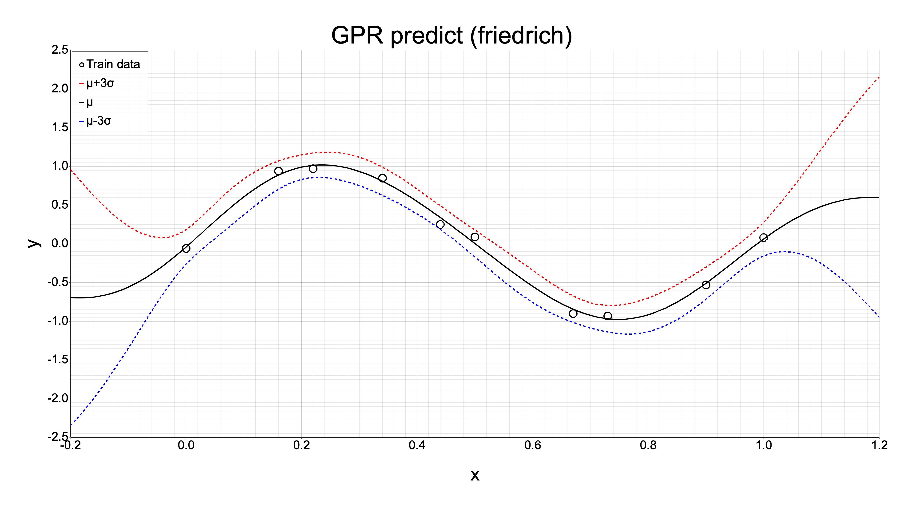

# gpr-friedrich-1x-rust

Rustにてfriedrichクレートを用いてガウス過程回帰（Gaussian Process Regression）を計算する。  
本リポジトリでは説明変数が1個の場合について扱っている。

## 処理の流れ

- 教育に用いる説明変数xと目的変数yが保存されたcsvファイルを読込
- 教育に用いる説明変数xと目的変数yをfriedrichクレートに適切なベクトルに変換
- friedrichクレートでガウス過程回帰のモデルを作成
- 作成したモデルを用いて、指定範囲の説明変数xに対する目的変数yを予測
- データのグラフを描画し画像ファイルとして出力

## 結果のグラフ

